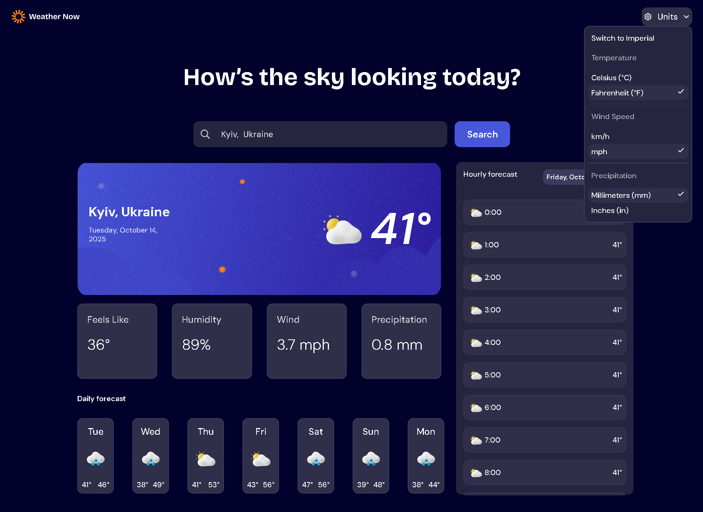
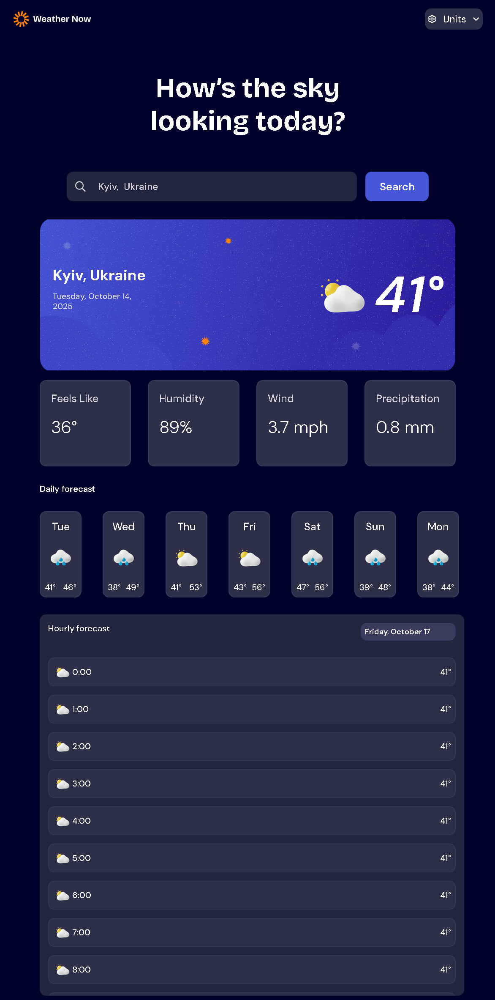
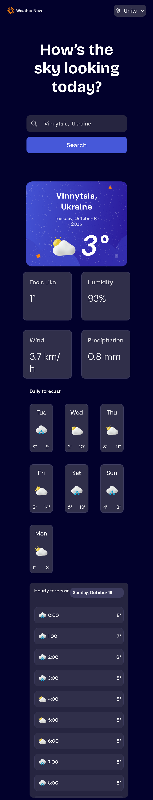

# Weather App 🌦️

A modern and responsive web application that provides real-time weather forecasts. Users can search for any city in the world and get detailed information about the current weather, as well as daily and hourly forecasts.

**[➡️ Live Demo](https://maksonst.github.io/weather-app/)**

 
---
 
---
 
---

### 🎯 Project Purpose

This project was created as a portfolio piece to demonstrate and practice key skills in frontend development. The main goals were:
* To work with external APIs and handle asynchronous data.
* To dynamically manipulate the DOM based on user input and API responses.
* To implement modern JavaScript (ES6+) features.
* To manage application state (like user settings) using browser storage.
* To build a fully responsive, mobile-first user interface.

---

## ✨ Features

This project implements a wide range of features to provide a complete user experience:

* **City Search:** Search for weather by any city name worldwide.
* **Search Autocomplete:** Get a list of suggestions as you type, with a `debounce` mechanism to optimize API calls.
* **Current Weather:** Displays current temperature, "feels like" temperature, wind speed, humidity, and precipitation.
* **Daily & Hourly Forecasts:**
    * A 7-day forecast with min/max temperatures and weather icons.
    * A detailed 24-hour forecast with a dropdown selector to view different days.
* **Unit Conversion:** Seamlessly switch all relevant data between Metric (Celsius, km/h) and Imperial (Fahrenheit, mph) systems.
* **Persistence:** The application remembers your last searched location and preferred units using `localStorage`, providing a personalized experience on your next visit.
* **Responsive Design:** The layout is fully adapted for **three screen sizes: mobile, tablet, and desktop**.
* **User Feedback:** Includes loading states during API calls and clear error messages for failed requests.

---

## 🛠️ Technologies & Methodology

The project is built using fundamental web technologies, with a focus on clean and maintainable code.

* **HTML5:** Used for the semantic structure of the application.
* **CSS3:** Styled with modern CSS features, including:
    * Flexbox and Grid for layout.
    * Custom Properties (Variables) for theming.
    * Media Queries for responsive design.
    * **BEM (Block, Element, Modifier):** A simplified BEM naming convention was used for CSS classes to improve code readability and maintainability.
* **JavaScript (ES6+):**
    * `async/await` for handling asynchronous API calls.
    * DOM Manipulation to dynamically render all data.
    * `localStorage` API for saving user preferences in the browser.
    * `CustomEvent` for modular communication.
* **APIs:**
    * **Open-Meteo:** Used for fetching all weather and forecast data.
* **Deployment:**
    * The project is deployed and hosted using **GitHub Pages**.

---

## 🚀 How to Run Locally

To run this project on your local machine, follow these simple steps:

1.  Clone the repository:
    ```bash
    git clone [https://github.com/MaksonSt/weather-app.git](https://github.com/MaksonSt/weather-app.git)
    ```
2.  Navigate to the project directory:
    ```bash
    cd weather-app
    ```
3.  Open the `index.html` file in your favorite web browser.


